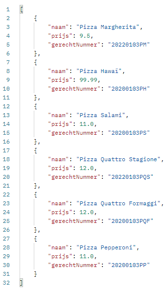
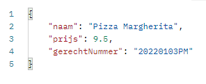
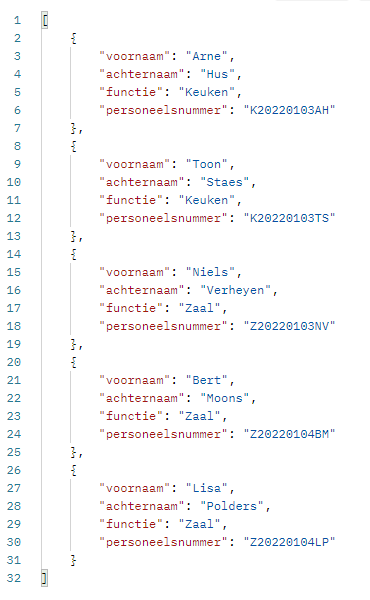
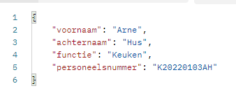
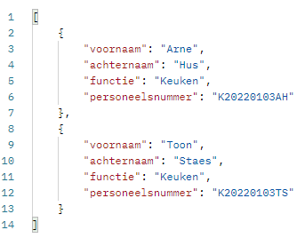
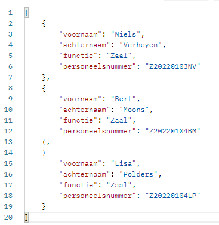
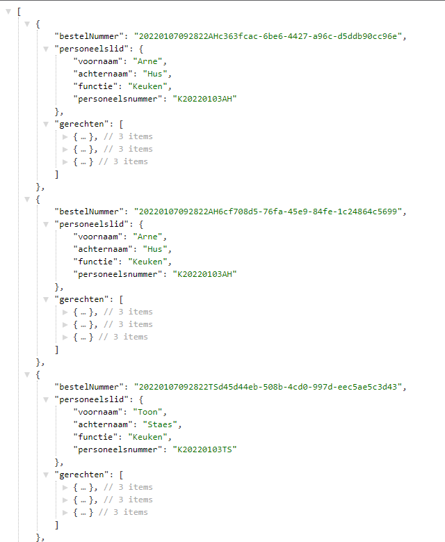
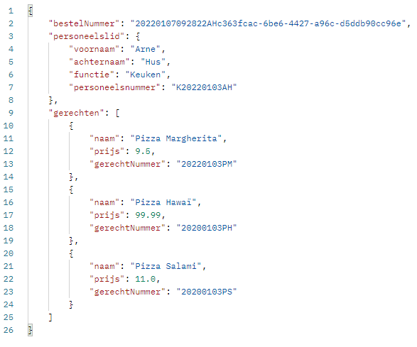
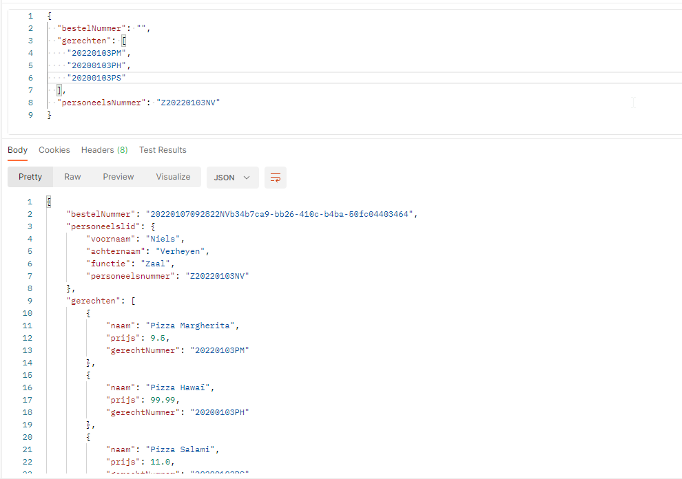

# README
Dit is de combinedServices repository voor het Advanced Programming Topics-project van Arne Hus, Toon Staes en Niels Verheyen.

Swagger-url: [Swagger](https://edge-service-server-arnehus.cloud.okteto.net/swagger-ui.html#/complete-bestelling-controller)
API base-url: [API base](https://edge-service-server-arnehus.cloud.okteto.net) (Op deze pagina gaat niets te zien zijn.)

Hieronder nog enkele screenshots van de resultaten van een raadpleging van de endpoints:

## Get

### Gerechten
url: [Get gerechten](https://edge-service-server-arnehus.cloud.okteto.net/gerechten)

### Gerecht
url: [Get gerecht by gerechtNummer](https://edge-service-server-arnehus.cloud.okteto.net/gerechten/20200103PH)

### Personeel
url: [Get personeel](https://edge-service-server-arnehus.cloud.okteto.net/personeel)

### Personeelslid
url: [Get personeel by personeelsNummer](https://edge-service-server-arnehus.cloud.okteto.net/personeel/K20220103AH)

### Keukenpersoneel
url: [Get keukenpersoneel](https://edge-service-server-arnehus.cloud.okteto.net/personeel/functie/keuken)

### Zaalpersoneel
url: [Get zaalpersoneel](https://edge-service-server-arnehus.cloud.okteto.net/personeel/functie/zaal)

### Bestellingen
url: [Get bestellingen](https://edge-service-server-arnehus.cloud.okteto.net/bestellingen)

### Bestelling
url: [Get bestelling by bestelNummer](https://edge-service-server-arnehus.cloud.okteto.net/bestelling/20220107092822AHc363fcac-6be6-4427-a96c-d5ddb90cc96e)

## Post/Put
### Bestelling
post: [Post bestelling](https://edge-service-server-arnehus.cloud.okteto.net/bestellingen)
put: [Post bestelling](https://edge-service-server-arnehus.cloud.okteto.net/bestellingen)
Deze acties zijn enkel uit te voeren op de frontend door de CORS-beveiliging die is ingesteld op de edge-service

## Delete
### Bestelling
[Delete bestelling](https://edge-service-server-arnehus.cloud.okteto.net/bestellingen/bestelnummer/20220107092822AHc363fcac-6be6-4427-a96c-d5ddb90cc96e)
Ook deze actie kan enkel uitgevoerd worden in de frontend en deze actie geeft niets terug.
